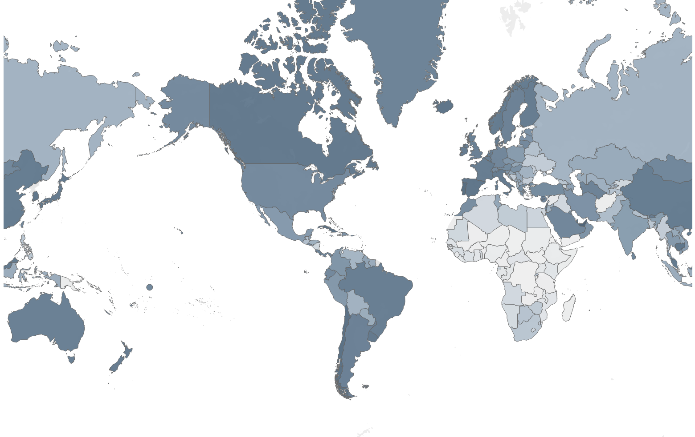
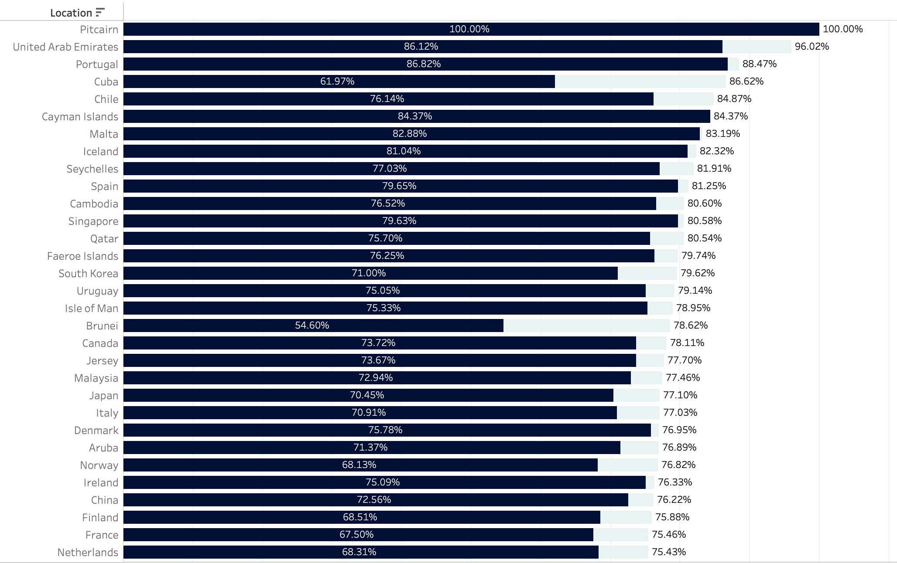
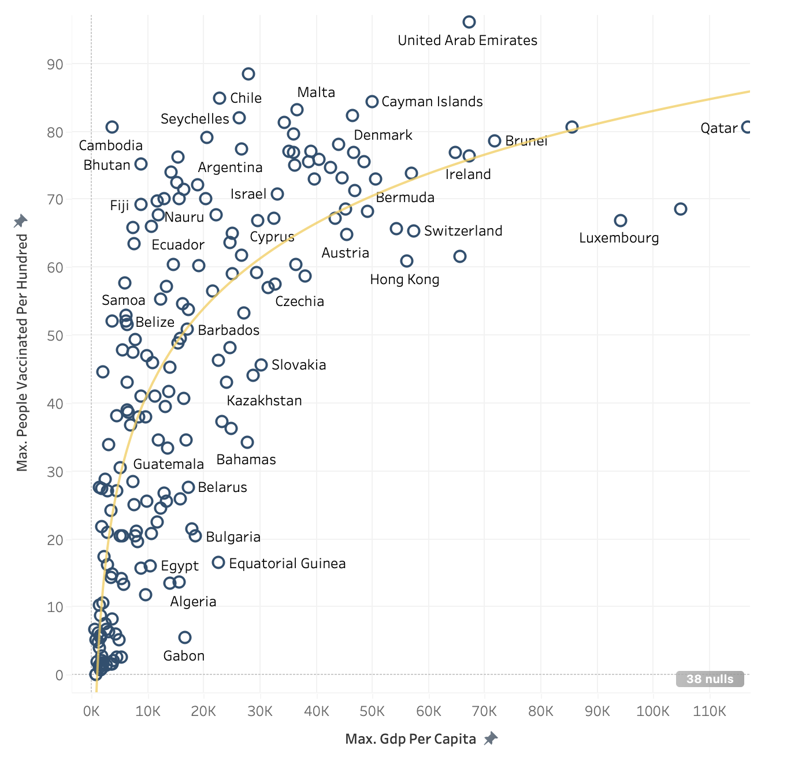
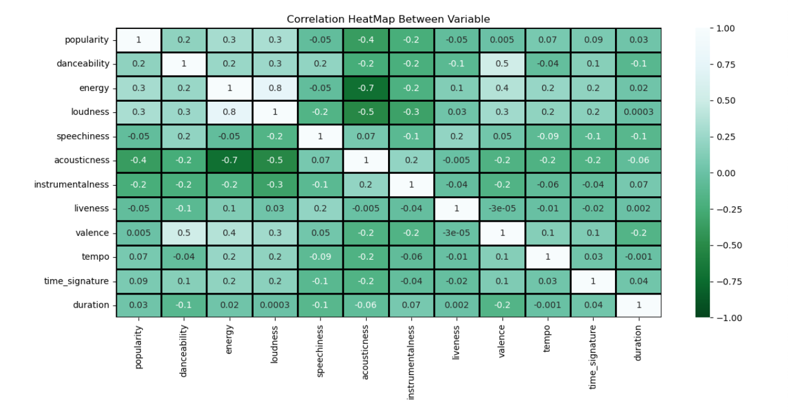
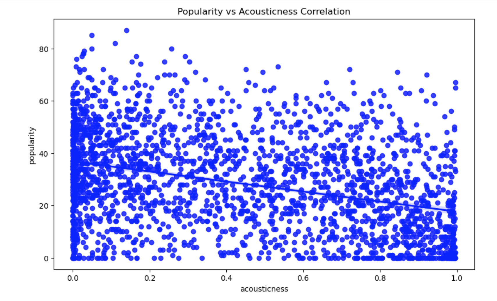
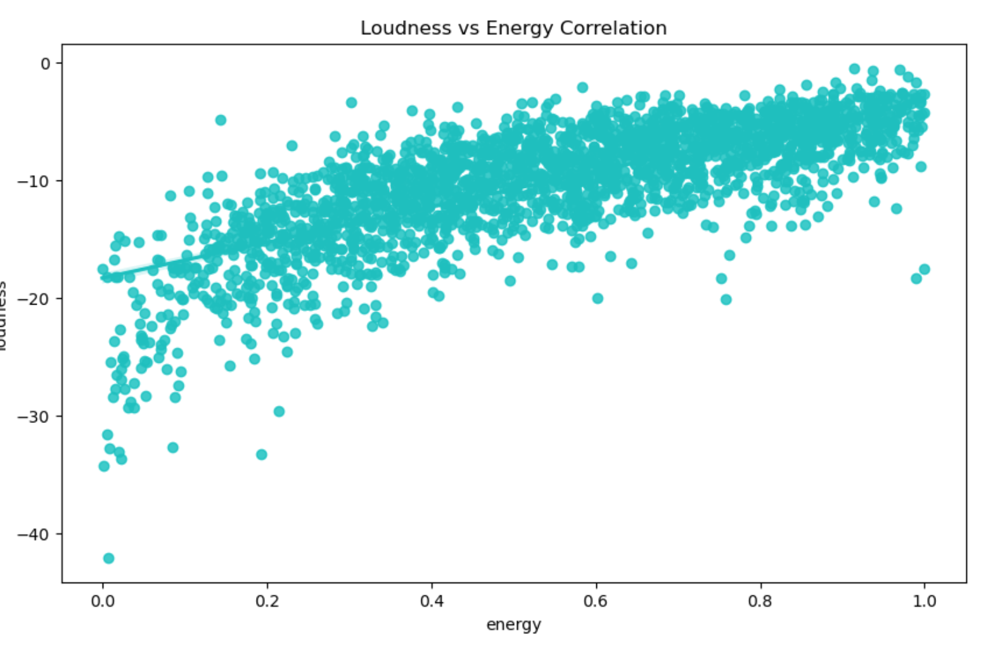

# [Project 1: COVID 19 Vaccine Tracker](covid.md)

* Generated interactive tool that allows user to Visual analytics tool examining full versus partial vaccination rates across all 195 countries from 2020-2021
* [Download the workbook here](vaccine tracker.twbx)
	
&nbsp;&nbsp;  

&nbsp;&nbsp;&nbsp;&nbsp;&nbsp;&nbsp; **Code and Resources Used**  
&nbsp;&nbsp;&nbsp;&nbsp;&nbsp;&nbsp; **Visualization:** Tableau Desktop  
&nbsp;&nbsp;&nbsp;&nbsp;&nbsp;&nbsp; **Version:** 2022.4  

&nbsp;&nbsp;  

&nbsp;&nbsp;&nbsp;&nbsp;&nbsp;&nbsp; **Code and Resources Used**  
&nbsp;&nbsp;&nbsp;&nbsp;&nbsp;&nbsp; **Python Version:** 3.7   
&nbsp;&nbsp;&nbsp;&nbsp;&nbsp;&nbsp; **Visualization:** Jupyter Notebook   
&nbsp;&nbsp;&nbsp;&nbsp;&nbsp;&nbsp; **Packages:** numpy, pandas, matplotlib.pyplot, seaborn

# [Project 2: Heart Disease Predictor ](project3.md)

*  View Code here: [Prediction System](HDprediction.ipynb)   
*  The goal of this machine learning project was to create a responsive system using python that can predict whether or not an individual has heart disease. It contains 14 attributes (out of 76 attributes) which are defined as age, sex, chest pain type, resting blood pressure, serum cholesterol, fasting blood sugar, resting electrocardiographic results, maximum heart rate achieved, exercise-induced angina, oldpeak — ST depression induced by exercise relative to rest, the slope of the peak exercise ST segment, number of major vessels and Thalassemia. Skills applied in this project included train test split (for model evaluation), as well as the creation of a logistic regression model (for binary classification).
Skills: data cleaning, data analysis, machine learning

## Code and Resources Used
* **Python Version:** 3.7  
* **Visualization:** Jupyter Notebook  
* **Packages:** numpy, pandas
